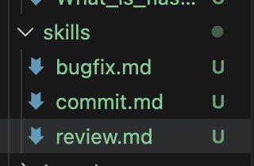
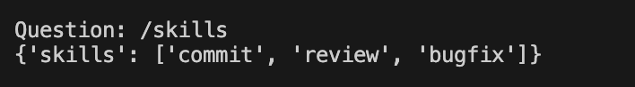
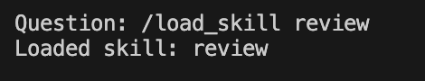
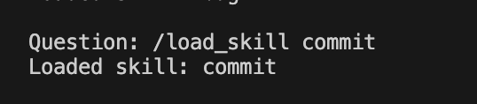
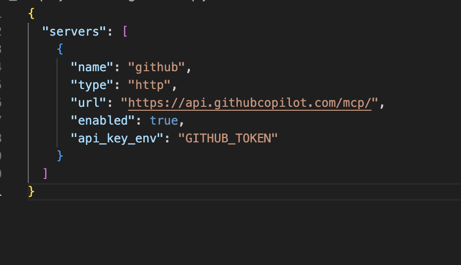
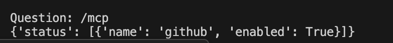
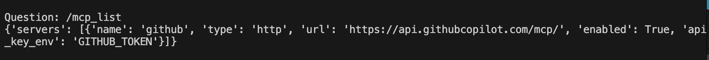

# Week 5 Submission - Extensible Coding Agent

## Overview

Week 5 was quite different from the previous weeks because there was no fixed build to implement. Instead, the focus was on making the agent extensible through Skills and MCP.

Going into this week, my agent from Week 4 already supported:

- Repository search
- Web search
- Research paper search
- Session saving and resuming
- Todo tracking
- Verification workflows
- Automatic note generation

The main thing I wanted to achieve this week was to make it possible to add new capabilities without constantly editing the agent code.

To do that, I implemented a Skills system and an MCP configuration system.

---

# Skills

The biggest addition this week was the Skills framework.

Before this week, every workflow had to be hardcoded somewhere in the codebase. That quickly becomes difficult to maintain because every new capability requires changing the source code.

To solve this, I moved workflows into markdown skill files.

The agent can now discover skills automatically and load them at runtime.

The current skills directory is shown below.



Currently I have implemented three skills:

- Review Skill
- Bugfix Skill
- Commit Skill

Each skill describes a workflow that the agent can follow.

The nice thing about this design is that if I want to add another workflow later, I only need to create another markdown file inside the skills folder.

No changes to agent.py are required.

---

# Skill Discovery

I added a command that allows the agent to discover all available skills automatically.

Command:

```text
/skills
```

Output:



The agent scans the skills directory and lists all available skills.

This means new skills automatically become available without modifying the agent logic.

---

# Skill Loading

After discovering available skills, they can be loaded during runtime.

## Loading Review Skill



## Loading Bugfix Skill


## Loading Commit Skill



This was one of the more useful additions because it allows the agent to switch workflows dynamically instead of relying on a single fixed prompt.

---

# MCP Support

The second major feature added this week was MCP configuration support.

Instead of hardcoding external integrations directly into the agent, I created a configuration-based system.

The MCP configuration file is shown below.



Currently I have configured a GitHub MCP server.

The important thing is that the configuration is dynamic.

If another MCP server needs to be added later, I only need to update the configuration file instead of modifying the source code.

---

# MCP Status Commands

To make MCP management easier, I added commands that display configured MCP servers.

Command:

```text
/mcp
```

Output:



This gives a quick overview of which MCP servers are currently enabled.

---

Command:

```text
/mcp_list
```

Output:



This displays detailed information about configured MCP servers including:

- Name
- Transport type
- URL
- Authentication environment variable
- Enabled status

---

# Environment Variables

All API keys are loaded through environment variables rather than being hardcoded into the repository.

The project includes an `.env.example` file that documents the required configuration values.

This keeps secrets out of source control and makes the project easier to share and deploy.

---

# Additional Features Already Present

Although Week 5 focused on Skills and MCP, my agent already had a number of features from previous weeks that are still available.

These include:

- Repository search
- Web search
- Paper search
- Todo tracking
- Verification workflows
- Session saving
- Session resuming
- Automatic note generation

Because of this, the Week 5 version is not just a skills loader but a complete coding and research assistant.

---

# How I Tested Everything

I tested the Skills system using the following commands:

```text
/skills
/load_skill review
/load_skill bugfix
/load_skill commit
```

The screenshots included above show successful execution of each command.

I tested the MCP system using:

```text
/mcp
/mcp_list
```

which correctly displayed the configured GitHub MCP server.

I also verified that MCP information was being loaded from the configuration file instead of being hardcoded.

---

# Cool Feature Demonstration

The feature I personally found most useful is the ability to extend the agent without touching the code.

For example:

1. Create a new markdown file inside the skills directory.
2. Define a workflow inside the file.
3. Launch the agent.
4. Run:

```text
/skills
```

The new skill automatically appears.

5. Run:

```text
/load_skill <skill_name>
```

and the skill becomes available immediately.

This means that new capabilities can be added simply by creating markdown files.

That was the main idea behind my Week 5 implementation.

---

# Problems I Faced

The biggest issue I faced this week was debugging the command routing logic.

Initially, skill-loading commands were accidentally falling through into the normal chat flow, which caused unexpected behaviour.

After debugging the command handling logic and fixing the routing, skills started loading correctly.

Another issue was model rate limits from OpenRouter during testing. Since I was using free models, some requests occasionally failed and had to be retried.

I also spent some time understanding how MCP configuration works and how GitHub MCP servers are configured.

---

# If I Had More Time

If I continue working on this project, I would like to add:

- Actual MCP tool execution
- MCP enable/disable commands
- Automatic skill selection
- Skill chaining
- GitHub issue management
- Pull request review workflows
- Repository summarisation skills

---

# Conclusion

The goal of Week 5 was to make the agent extensible rather than continuously adding more hardcoded features.

I achieved this by introducing:

- A Skills framework
- Dynamic skill loading
- MCP configuration support
- Environment-based authentication

As a result, the agent can now grow through configuration and markdown skills instead of requiring code changes for every new capability.

Overall, this week helped me move from building individual features to thinking about how to design systems that can be extended in the future.